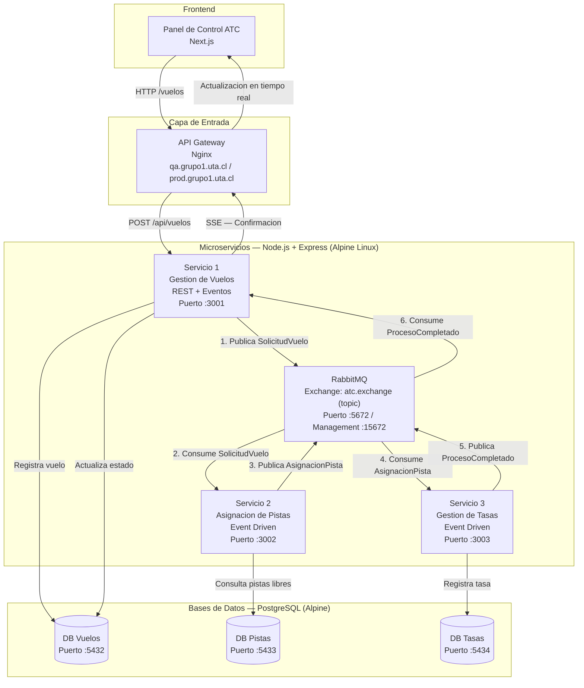

# Controlador de Trafico Aereo (ATC)

Proyecto final de Aplicaciones Distribuidas — Grupo 1. Sistema de microservicios para la gestion automatizada de aterrizajes, asignacion de pistas y calculo de tasas aeroportuarias.

---

## 1. Diagrama Arquitectonico

### Flujo

1. Un **piloto** (o el frontend simulandolo) envia una solicitud de aterrizaje via REST al API Gateway.
2. El **Servicio 1 (Gestion de Vuelos)** recibe la peticion, registra el vuelo en su base de datos y publica el evento `SolicitudVuelo` en RabbitMQ.
3. El **Servicio 2 (Asignacion de Pistas)** consume el evento, consulta su base de datos de pistas, selecciona una pista libre y publica el evento `AsignacionPista`.
4. El **Servicio 3 (Gestion de Tasas)** consume `AsignacionPista`, calcula los costos operativos del aterrizaje, los registra y publica `ProcesoCompletado`.
5. El **Servicio 1** consume `ProcesoCompletado`, actualiza el estado del vuelo y notifica al frontend via SSE (Server-Sent Events) que el proceso fue exitoso.

---

## Stack Tecnologico

| Capa | Tecnologia |
|---|---|
| Backend | Node.js + Express |
| Frontend | Next.js |
| API Gateway | Nginx |
| Message Broker | RabbitMQ |
| Bases de Datos | PostgreSQL (1 por microservicio) |
| Contenedores | Docker (imagenes node:18-alpine) |
| Orquestacion | Kubernetes / K3s |
| CI/CD | GitHub Actions (ramas develop y main) |

---

## Repositorio

- *Rama develop*: despliegues automaticos a QA (qa.grupo1.uta.cl)
- *Rama main*: despliegues automaticos a PROD (prod.grupo1.uta.cl)

---

## Integrantes — Grupo 1

| Nombre | Rol |
|---|---|
| Katalina Ignacia Oviedo Diaz | Backend |
| Fernanda Javiera Ventura Briceno | Frontend |
| Sebastian Alejandro Torres Santibanez | API Gateway |
| Cristhian Manuel Sanchez Femayor | Database |
