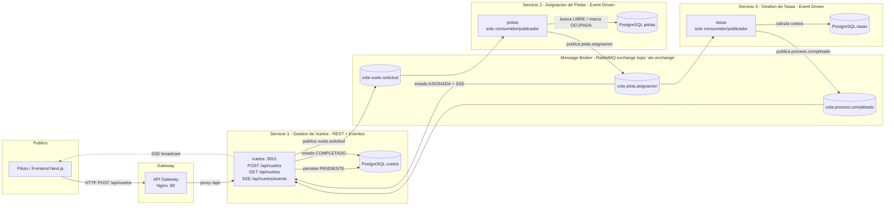

# Controlador de Trafico Aereo (ATC) — Grupo 1

Proyecto final de Aplicaciones Distribuidas. Sistema de microservicios para la gestion automatizada de aterrizajes, asignacion de pistas y calculo de tasas aeroportuarias, con comunicacion asincrona via RabbitMQ, despliegue automatizado con GitHub Actions y orquestacion en Kubernetes/K3s sobre los servidores PowerEdge del departamento.

Integrantes — Grupo 1:

| Nombre | Rol |
|---|---|
| Katalina Ignacia Oviedo Diaz | Backend |
| Fernanda Javiera Ventura Briceno | Frontend |
| Sebastian Alejandro Torres Santibanez | API Gateway |
| Cristhian Manuel Sanchez Femayor | Database |

---

## 1. Diagrama Arquitectonico

Camino del mensaje a traves de los tres servicios logicos y el broker de mensajería. El unico punto de entrada publico es el API Gateway (Nginx); los servicios `pistas` y `tasas` no exponen HTTP, solo reaccionan a eventos.


```mermaid
flowchart LR
    subgraph Publico
        Piloto[Piloto / Frontend Next.js]
    end

    subgraph Gateway
        NGINX[API Gateway<br/>Nginx :80]
    end

    subgraph Bus[Message Broker - RabbitMQ exchange topic 'atc.exchange']
        Q1[(cola vuelo.solicitud)]
        Q2[(cola pista.asignacion)]
        Q3[(cola proceso.completado)]
    end

    subgraph S1[Servicio 1 - Gestion de Vuelos - REST + Eventos]
        V1[vuelos :3001<br/>POST /api/vuelos<br/>GET /api/vuelos<br/>SSE /api/vuelos/events]
        PG1[(PostgreSQL vuelos)]
    end

    subgraph S2[Servicio 2 - Asignacion de Pistas - Event Driven]
        P1[pistas<br/>solo consumidor/publicador]
        PG2[(PostgreSQL pistas)]
    end

    subgraph S3[Servicio 3 - Gestion de Tasas - Event Driven]
        T1[tasas<br/>solo consumidor/publicador]
        PG3[(PostgreSQL tasas)]
    end

    Piloto -->|HTTP POST /api/vuelos| NGINX
    NGINX -->|proxy /api/| V1
    V1 -->|persiste PENDIENTE| PG1
    V1 -->|publica vuelo.solicitud| Q1
    Q1 --> P1
    P1 -->|busca LIBRE / marca OCUPADA| PG2
    P1 -->|publica pista.asignacion| Q2
    Q2 --> T1
    Q2 -->|estado ASIGNADA + SSE| V1
    T1 -->|calcula costos| PG3
    T1 -->|publica proceso.completado| Q3
    Q3 --> V1
    V1 -->|estado COMPLETADO| PG1
    V1 -.->|SSE broadcast| Piloto
```

**Secuencia del flujo:**

1. El piloto envia `POST /api/vuelos` al gateway (dominio `qa.grupo1.uta.cl` o `prod.grupo1.uta.cl`).
2. `vuelos` registra el vuelo en `PostgreSQL vuelos` con estado `PENDIENTE` y publica `vuelo.solicitud`.
3. `pistas` consume `vuelo.solicitud`, busca la primera pista `LIBRE` en su base, la marca `OCUPADA` y publica `pista.asignacion`.
4. `vuelos` consume `pista.asignacion`, actualiza el estado a `ASIGNADA` y notifica al frontend por SSE.
5. `tasas` consume `pista.asignacion`, calcula costos segun tipo de pista, los registra y publica `proceso.completado`.
6. `vuelos` consume `proceso.completado`, actualiza a `COMPLETADO` y hace broadcast por SSE a los clientes conectados a `/api/vuelos/events`.

> El resultado del diagrama tambien esta exportado como editable en `db/vuelos/vuelos.drawio`, `db/pistas/pistas.drawio` y `db/tasas/tasas.drawio`.

---

## 2. Contrato de Datos

Tres eventos viajan por el exchange topic `atc.exchange` (RabbitMQ). Todas las cargas son JSON en UTF-8. Las `routing key` son jerarquicas y los servicios las vinculan a colas durables nombradas.

### Evento 1 — SolicitudVuelo  (routing key `vuelo.solicitud`)

Publicado por `vuelos` tras recibir `POST /api/vuelos`. Consumido por `pistas`.

```json
{
  "evento": "SolicitudVuelo",
  "vuelo_id": "ATC-001",
  "aerolinea": "LATAM",
  "numero_vuelo": "LA1234",
  "origen": "SCL",
  "destino": "ARI",
  "aeronave": "A320",
  "pasajeros": 150,
  "timestamp": "2026-07-20T12:00:00.000Z",
  "estado": "PENDIENTE"
}
```

### Evento 2 — AsignacionPista  (routing key `pista.asignacion`)

Publicado por `pistas` tras reservar la pista. Consumido por `tasas` y por `vuelos` (para setear estado `ASIGNADA` y notificar SSE).

```json
{
  "evento": "AsignacionPista",
  "vuelo_id": "ATC-001",
  "pista_id": "P03",
  "tipo_pista": "COMERCIAL",
  "timestamp": "2026-07-20T12:00:01.500Z"
}
```

### Evento 3 — ProcesoCompletado  (routing key `proceso.completado`)

Publicado por `tasas` tras registrar el cobro. Consumido por `vuelos` para cerrar el flujo.

```json
{
  "evento": "ProcesoCompletado",
  "vuelo_id": "ATC-001",
  "pista_id": "P03",
  "tasa": {
    "aterrizaje": 250,
    "estacionamiento": 50,
    "moneda": "USD",
    "total": 300
  },
  "timestamp": "2026-07-20T12:00:02.800Z"
}
```

### Reglas de tarificacion (servicio `tasas`)

| Tipo de pista | Aterrizaje (USD) | Estacionamiento (USD) | Total (USD) |
|---|---|---|---|
| COMERCIAL | 250 | 50 | 300 |
| CARGA     | 200 | 80 | 280 |
| PRIVADO   | 150 | 30 | 180 |

### Estructura del vuelo (PostgreSQL `vuelos`)

`vuelo_id` (PK, string), `aerolinea`, `numero_vuelo`, `origen`, `destino`, `aeronave`, `pasajeros` (int), `estado` (`PENDIENTE` → `ASIGNADA` → `COMPLETADO`), `timestamp_solicitud`.

### Estructura de pista (PostgreSQL `pistas`)

`pista_id` (PK), `tipo` (`COMERCIAL`/`CARGA`/`PRIVADO`), `estado` (`LIBRE`/`OCUPADA`).

### Estructura de tasa (PostgreSQL `tasas`)

`tasa_id` (PK autoincrement), `vuelo_id` (FK logico), `pista_id`, `tipo_pista`, `aterrizaje`, `estacionamiento`, `total`, `moneda`, `timestamp`.

---

## 3. Guia de Configuracion de Acceso (archivo `hosts`)

Queda prohibido el acceso por IP:puerto. El sistema resuelve por nombres de dominio virtuales `.uta.cl` mediante el Ingress de Traefik (incluido con K3s). En la maquina del evaluador, apuntar ambos dominios a la IP del servidor K3s (VM1 del grupo):

### Linux / macOS
```bash
sudo tee -a /etc/hosts <<EOF
146.83.102.20 qa.grupo1.uta.cl
146.83.102.20 prod.grupo1.uta.cl
EOF
```

### Windows (PowerShell como administrador)
```powershell
Add-Content C:\Windows\System32\drivers\etc\hosts "`n146.83.102.20 qa.grupo1.uta.cl"
Add-Content C:\Windows\System32\drivers\etc\hosts "`n146.83.102.20 prod.grupo1.uta.cl"
```

Verificar:
```bash
ping qa.grupo1.uta.cl        # debe responder 146.83.102.20
curl http://qa.grupo1.uta.cl # debe devolver el frontend
```

> Si otro grupo usa el mismo clúster K3s, no hay conflicto: cada dominio es distinto y Traefik enruta por `host`.

---

## 4. Manual Operativo de Control

Comandos indispensables para revisar el estado del sistema, los logs unificados y certificar que las copias de seguridad persisten.

### Estado general del sistema
```bash
kubectl -n grupo1-qa get pods,svc,ingress                # QA  (cambiar a grupo1-prod para PROD)
kubectl -n grupo1-qa get deployments
kubectl -n grupo1-qa top pods                             # requiere metrics-server (opcional)
```

### Logs unificados (todas las trazas en una sola vista)
```bash
./scripts/logs-unificados.sh grupo1-qa                    # sigue en stream (-f)
# Equivalente interno:
kubectl -n grupo1-qa logs -l app.kubernetes.io/part-of=atc --all-containers --prefix -f --max-log-requests 20
```

### Probar el flujo extremo a extremo
```bash
curl -X POST http://qa.grupo1.uta.cl/api/vuelos \
  -H "Content-Type: application/json" \
  -d '{"vuelo_id":"ATC-QA-001","aerolinea":"LATAM","numero_vuelo":"LA1234","origen":"SCL","destino":"ARI","aeronave":"A320","pasajeros":150}'

sleep 5
curl http://qa.grupo1.uta.cl/api/vuelos/ATC-QA-001         # estado: COMPLETADO
curl http://qa.grupo1.uta.cl/api/vuelos                    # historial completo
```

### Verificar persistencia de datos (caida y reinicio de un pod de BD)
```bash
kubectl -n grupo1-qa delete pod -l app=postgres-vuelos     # elimina el pod; el Deployment lo recrea
# el PVC conserva los datos: al volver a levantar, el historial de vuelos sigue intacto
kubectl -n grupo1-qa exec deployment/postgres-vuelos -- psql -U atc -d vuelos -c "SELECT COUNT(*) FROM vuelos;"
```

### Verificar respaldos automaticos (CronJob cada 10 minutos)
```bash
kubectl -n grupo1-qa get cronjobs
kubectl -n grupo1-qa get jobs --sort-by=.metadata.creationTimestamp
kubectl -n grupo1-qa logs -l job-name --tail=20

# Listar los archivos de respaldo en el PVC compartido (montado en /backups)
kubectl -n grupo1-qa exec deployment/postgres-vuelos -- ls -la /backups
# Para restaurar manualmente un respaldo (escenario de resiliencia):
# kubectl -n grupo1-qa exec -i deployment/postgres-vuelos -- \
#   psql -U atc -d vuelos < /backups/vuelos-<fecha>.sql
```

### Forzar un deploy desde CI
- `git push origin develop` -> deploy automatico a QA
- `git push origin main`    -> deploy automatico a PROD
- Seguir en GitHub Actions (tab Actions) los jobs `Build and Push` y `Deploy to QA` / `Deploy to PROD`.

### Resumen de puertos / conexiones
| Base | Servicio interno | Puerto interno | Usuario | Password |
|---|---|---|---|---|
| vuelos | postgres-vuelos | 5432 | atc | atc123 |
| pistas | postgres-pistas | 5432 | atc | atc123 |
| tasas  | postgres-tasas  | 5432 | atc | atc123 |
| RabbitMQ AMQP | rabbitmq | 5672 | guest | guest |

Ningun puerto NodePort se expone al publico. El acceso es exclusivamente por dominio via Ingress en el puerto 80.

---

## Stack Tecnologico

| Capa | Tecnologia |
|---|---|
| Backend | Node.js 18-alpine + Express |
| Frontend | Next.js 14 (App Router) |
| API Gateway | Nginx (proxy /api + estatico) |
| Message Broker | RabbitMQ 3 (exchange topic `atc.exchange`) |
| Bases de Datos | PostgreSQL 15-alpine, una por microservicio |
| Orquestacion | Kubernetes (K3s) con Kustomize |
| CI/CD | GitHub Actions (develop -> QA, main -> PROD) |
| Registro de imagenes | GHCR (ghcr.io/cristhian-s1/atc-*) |

---

## Repositorio

- *Rama develop*: despliegues automaticos a QA (qa.grupo1.uta.cl)
- *Rama main*: despliegues automaticos a PROD (prod.grupo1.uta.cl)

---

## Integrantes — Grupo 1

| Nombre | Rol |
|---|---|
| Katalina Ignacia Oviedo Diaz | Backend |
| Fernanda Javiera Ventura Briceno | Frontend |
| Sebastian Alejandro Torres Santibanez | API Gateway |
| Cristhian Manuel Sanchez Femayor | Database |
